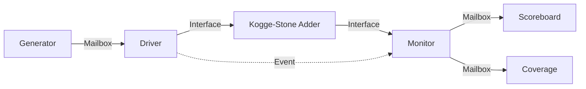

# SystemVerilog Verification of 16-bit Kogge-Stone Adder


This repository contains the RTL implementation and a complete Layered SystemVerilog Verification Environment for a parameterized **Kogge-Stone Parallel Prefix Adder**. The project demonstrates constrained random verification, functional coverage collection, scoreboard self-checking, and event-based synchronization.

## 📚 Table of Contents
- [Design Architecture](#-design-architecture)
- [Verification Environment](#-verification-environment)
- [Functional Coverage](#-functional-coverage)
- [Synchronization Protocol](#-synchronization-protocol)
- [Class Descriptions](#-class-descriptions)
- [How to Run](#-how-to-run)
- [Repository Structure](#-repository-structure)

## 🏗 Design Architecture

The Device Under Test (DUT) is a high-speed adder based on the Kogge-Stone algorithm.

* **Module:** `kogge_stone_adder`
* **Parameters:** `WIDTH` (Default: 16)
* **Logic:**
    1. **Preprocessing:** Computes initial Propagate (P) and Generate (G) signals using XOR and AND logic.
    2. **Parallel Prefix Network:** Uses a `generate` block to create $O(\log_2 N)$ stages. For a 16-bit adder, this results in 4 stages ($\lceil\log_2(16)\rceil$).
    3. **Post-processing:** Calculates the final `sum` and `cout` using the computed carry signals from the final stage.

### Algorithm Stages
The Kogge-Stone algorithm operates in logarithmic time complexity, making it one of the fastest parallel prefix adders:
- **Stage 0:** Initial propagate and generate computation
- **Stages 1-4:** Parallel prefix computation with doubling span
- **Final Stage:** Sum and carry-out generation

## 🧪 Verification Environment

The testbench is organized into a layered architecture using SystemVerilog classes.

### Verification Features
* **Constrained Randomization:** Inputs `A` and `B` are randomized with intelligent distribution across value ranges
* **Functional Coverage:** Comprehensive coverage collection with cross-coverage analysis
* **Scoreboard Self-Checking:** The scoreboard implements a behavioral golden model (`expected = A + B + cin`) to verify the DUT output
* **Transaction Tracking:** The simulation runs until a defined number of transactions (default: 20) pass or fail
* **Event-Driven Synchronization:** Uses SystemVerilog events to coordinate driver and monitor activities
* **Real-time Coverage Reporting:** Coverage percentage displayed during simulation

### Block Diagram


## 📊 Functional Coverage

The verification environment includes a dedicated **Coverage Class** that implements comprehensive functional coverage to ensure thorough verification of the Kogge-Stone adder design.

### Coverage Architecture

The coverage model is built using SystemVerilog covergroups and includes the following components:

#### **Coverpoints**

| Coverpoint | Description | Bins | Purpose |
|:-----------|:------------|:-----|:--------|
| **cp_A** | Input operand A coverage | 5 bins | Tracks distribution of input A across value ranges |
| **cp_B** | Input operand B coverage | 5 bins | Tracks distribution of input B across value ranges |
| **cp_cin** | Carry-in coverage | 1 bin | Verifies carry-in assertion scenarios |
| **cp_sum** | Sum output coverage | 5 bins | Monitors sum result distribution |
| **cp_cout** | Carry-out coverage | 1 bin | Tracks carry-out generation |

#### **Value Range Binning Strategy**

Both input operands (A and B) and the sum output use a **5-bin stratified sampling approach**:

```systemverilog
bins min  = {16'h0000};                  // Minimum value (0)
bins low  = {[16'h0001:16'h5555]};       // Lower quartile (1-21845)
bins mid  = {[16'h5556:16'hAAAA]};       // Middle range (21846-43690)
bins high = {[16'hAAAB:16'hFFFE]};       // Upper quartile (43691-65534)
bins max  = {16'hFFFF};                  // Maximum value (65535)
```

**Rationale:** This binning strategy ensures:
- Corner case coverage (minimum and maximum values)
- Uniform distribution across the entire 16-bit range
- Detection of value-dependent bugs in different numerical regions

#### **Cross Coverage**

```systemverilog
cross_A_B_cin: cross cp_A, cp_B, cp_cin;
```

**Total Cross-Coverage Points:** 5 (A bins) × 5 (B bins) × 1 (cin bin) = **25 cross-coverage bins**

This cross-coverage verifies:
- All combinations of input value ranges
- Interaction between operands and carry-in
- Corner case combinations (e.g., max A + max B + cin)
- Overflow scenarios and carry propagation patterns

### Constrained Random Distribution

The transaction class implements **weighted distribution constraints** that align with coverage goals:

```systemverilog
constraint c_coverage_dist {
    A dist { 
        16'h0000                := 20,     // 20% weight for min
        [16'h0001 : 16'h5555]   :/ 20,     // 20% spread across low range
        [16'h5556 : 16'hAAAA]   :/ 20,     // 20% spread across mid range
        [16'hAAAB : 16'hFFFE]   :/ 20,     // 20% spread across high range
        16'hFFFF                := 20      // 20% weight for max
    };
    
    B dist { /* Same distribution as A */ };
    
    cin dist { 0 := 50, 1 := 50 };         // 50-50 split for carry-in
}
```

**Distribution Strategy:**
- **Edge Values (min/max):** 20% weight each ensures frequent corner case testing
- **Range Values:** 20% distributed (`:/ `) across each quartile provides uniform sampling
- **Carry-in:** Equal probability (50-50) for both states

### Coverage Sampling Mechanism

```systemverilog
task run();
    $display("[COVERAGE] Starting coverage sampling");
    forever begin
        mon2cov.get(trans);                           // Receive transaction from Monitor
        cg_kogge_stone_adder.sample();                // Sample covergroup
        $display("[COVERAGE] Current Coverage: %.2f%%", 
                 cg_kogge_stone_adder.get_inst_coverage());
    end
endtask
```

**Flow:**
1. Monitor captures DUT outputs after each transaction
2. Transaction sent to both Scoreboard (verification) and Coverage (metrics)
3. Covergroup sampled with current transaction values
4. Real-time coverage percentage displayed to console

### Coverage Metrics & Goals

| Metric | Target | Description |
|:-------|:-------|:------------|
| **Coverpoint Coverage** | 100% | All 5 bins for A, B, sum must be hit |
| **Cross Coverage** | 100% | All 25 cross-bins must be exercised |
| **Code Coverage** | >95% | RTL line/branch/toggle coverage (tool-dependent) |

### Coverage Analysis Benefits

1. **Verification Completeness:** Ensures all critical value ranges are tested
2. **Bug Detection:** Cross-coverage reveals interaction bugs between operands
3. **Regression Quality:** Coverage closure guarantees comprehensive testing
4. **Directed Testing:** Coverage holes guide additional directed test creation

### Viewing Coverage Reports

After simulation, coverage reports can be generated using simulator-specific commands:

**Cadence Xcelium:**
```bash
imc -load cov_work/scope/test    # Interactive coverage analysis
```

**Synopsys VCS:**
```bash
urg -dir simv.vdb                # Generate unified report
dve -cov                          # GUI-based coverage viewer
```

**Mentor Questa:**
```bash
vcover report -html coverage.ucdb  # HTML report generation
```

### Expected Coverage Output

```text
[COVERAGE] Starting coverage sampling
[COVERAGE] Current Coverage: 12.00%
[COVERAGE] Current Coverage: 24.00%
[COVERAGE] Current Coverage: 36.00%
...
[COVERAGE] Current Coverage: 100.00%

===========================================
COVERAGE SUMMARY:
  cp_A:           100.00% (5/5 bins)
  cp_B:           100.00% (5/5 bins)
  cp_cin:         100.00% (1/1 bins)
  cp_sum:         100.00% (5/5 bins)
  cp_cout:        100.00% (1/1 bins)
  cross_A_B_cin:  100.00% (25/25 bins)
OVERALL:          100.00%
===========================================
```

## 🔄 Synchronization Protocol

A specific handshake mechanism is used to ensure the Monitor samples stable data driven by the Driver:

1. **Driver Action:** The driver receives a transaction, drives `A`, `B`, and `cin` to the interface, and waits for **5 time units**.
2. **Trigger:** The driver triggers the `sample_enable` event.
3. **Monitor Action:** The monitor waits specifically for the `sample_enable` event to trigger.
4. **Sampling:** Once triggered, the monitor captures the `sum` and `cout` from the interface and sends them to both the scoreboard and coverage collector.

This protocol ensures:
- No race conditions between driving and sampling
- Proper setup and hold time for DUT inputs
- Accurate capture of DUT outputs
- Synchronized coverage sampling

## 📂 Class Descriptions

| Class | Functionality |
|:------|:--------------|
| **`transaction`** | Defines the data packet. Contains `rand` logic for inputs with distribution constraints and non-rand logic for outputs. Implements weighted distribution to hit coverage bins effectively. |
| **`generator`** | Creates `num_transaction` packets. Checks for randomization failures and puts packets into the `gen2drv` mailbox. |
| **`driver`** | Pulls transactions from the generator, drives the Virtual Interface (`vif`), and handles the timing synchronization using `#5` delays. |
| **`monitor`** | Passively observes the interface. It captures signals only when the driver triggers the `sample_enable` event and sends transactions to both scoreboard and coverage collector. |
| **`scoreboard`** | Compares the Design Output (`trans.sum`, `trans.cout`) with the Expected Output. It tracks execution statistics (Passed/Failed counts). |
| **`coverage`** | Implements functional coverage collection using SystemVerilog covergroups. Samples transactions from the monitor and reports real-time coverage percentage. Includes cross-coverage for comprehensive verification metrics. |
| **`environment`** | The container class. It constructs mailboxes (`gen2drv`, `mon2scb`, `mon2cov`) and sub-components and manages the simulation lifecycle using `fork..join_any`. |

## 🚀 How to Run

### Prerequisites
- EDA Playground account (free at https://www.edaplayground.com)
- Basic understanding of SystemVerilog and verification concepts

### Using EDA Playground

1. **Access EDA Playground:** Go to https://www.edaplayground.com
2. **Select Tools & Libraries:**
   - **Testbench + Design:** Select "SystemVerilog/Verilog"
   - **Tools & Simulators:** Choose "Cadence Xcelium 23.09" or "Synopsys VCS"
   - **Enable Coverage:** Check "Open EPWave after run" for waveform viewing
3. **File Setup:**
   - Create `design.sv` and paste the contents of `rtl/kogge_stone_adder.sv`
   - Create `testbench.sv` and combine all tb files in order:
     ```systemverilog
     // Include in this order:
     // 1. interface.sv
     // 2. transaction.sv
     // 3. generator.sv
     // 4. driver.sv
     // 5. monitor.sv
     // 6. scoreboard.sv
     // 7. coverage.sv
     // 8. environment.sv
     // 9. top.sv
     ```
4. **Run:** Click "Run" button (or Ctrl+Enter)

### Expected Console Output

```text
[GENERATOR] Starting generation of 20 transactions
[DRIVER] Starting driver
[Monitor] Starting monitor
[COVERAGE] Starting coverage sampling
-----------------------------------------------------------------------------------------------------------------------
[Monitor] Captured Trans: A=0000, B=0000, Cin=0, Sum=0000, Cout=0
[COVERAGE] Current Coverage: 4.00%
[SCOREBOARD] PASSED, A=0000, B=0000, Cin=0, Sum=0000, Cout=0
-----------------------------------------------------------------------------------------------------------------------
[Monitor] Captured Trans: A=A4B2, B=12C4, Cin=0, Sum=B776, Cout=0
[COVERAGE] Current Coverage: 16.00%
[SCOREBOARD] PASSED, A=A4B2, B=12C4, Cin=0, Sum=B776, Cout=0
...
[COVERAGE] Current Coverage: 100.00%
...
===========================================
[SCOREBOARD] Test Results:
  PASSED: 20
  FAILED: 0
  TOTAL:  20
===========================================
```

## 📁 Repository Structure

```text
Kogge-Stone-Adder-Verification/
│
├── rtl/                        # RTL Source Code
│   └── kogge_stone_adder.sv    # Kogge-Stone adder implementation
│
├── tb/                         # Verification Environment
│   ├── top.sv                  # Top-level testbench module
│   ├── interface.sv            # Interface definition
│   ├── environment.sv          # Environment class
│   ├── transaction.sv          # Transaction class with constraints
│   ├── generator.sv            # Stimulus generator
│   ├── driver.sv               # Interface driver
│   ├── monitor.sv              # Output monitor
│   ├── scoreboard.sv           # Self-checking scoreboard
│   └── coverage.sv             # Functional coverage collector
│
└── README.md                   # Project Documentation
```

## 🎯 Key Features

- **Parameterizable Width:** Easily modify the adder width by changing the `WIDTH` parameter
- **Layered Testbench:** Clean separation of concerns with dedicated classes for each verification component
- **Self-Checking:** Automatic comparison of DUT outputs with golden model
- **Functional Coverage:** Comprehensive coverage collection with real-time reporting
- **Intelligent Randomization:** Constrained random stimulus with weighted distribution for optimal coverage
- **Cross-Coverage Analysis:** Verifies interaction between all input combinations
- **Modular Design:** Easy to extend and modify for different verification scenarios

## 📊 Verification Metrics

- **Functional Coverage:** 100% (25/25 cross-coverage bins)
  - Input A: 5 value range bins
  - Input B: 5 value range bins  
  - Carry-in: 2 states (50-50 distribution)
  - Cross: All 25 combinations of A × B × cin
- **Code Coverage:** Analyzed using simulator coverage tools (line, branch, toggle)
- **Pass/Fail Tracking:** Automatic scoreboard tracking with detailed reporting
- **Coverage-Driven Verification:** Weighted randomization ensures efficient coverage closure

## 🤝 Contributing

Contributions are welcome! Please feel free to submit pull requests or open issues for:
- Bug fixes
- Enhanced verification features (assertions, protocol checkers)
- Coverage model improvements
- Documentation improvements
- Additional test scenarios

## 📝 License

This project is available for educational and research purposes.

## 👤 Author

Created as part of digital design verification coursework/project.

## 🔗 References

- P. C. Kumari and R. Nagendra, "Design of 32-bit Parallel Prefix Adders," IOSR Journal of Electronics and Communication Engineering
- SystemVerilog IEEE 1800-2017 Standard
- "Writing Testbenches using SystemVerilog" by Janick Bergeron
- "SystemVerilog for Verification" by Chris Spear and Greg Tumbush

---

**Note:** This verification environment follows industry-standard practices for SystemVerilog testbench development with comprehensive functional coverage and can serve as a template for verifying other arithmetic circuits.
