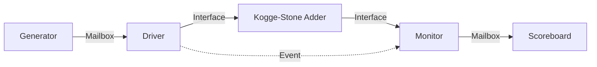

# SystemVerilog Verification of 16-bit Kogge-Stone Adder


This repository contains the RTL implementation and a complete Layered SystemVerilog Verification Environment for a parameterized **Kogge-Stone Parallel Prefix Adder**. The project demonstrates constrained random verification, scoreboard self-checking, and event-based synchronization.

## 📚 Table of Contents
- [Design Architecture](#-design-architecture)
- [Verification Environment](#-verification-environment)
- [Synchronization Protocol](#-synchronization-protocol)
- [Class Descriptions](#-class-descriptions)
- [How to Run](#-how-to-run)
- [Repository Structure](#-repository-structure)

## 🏗 Design Architecture

The Device Under Test (DUT) is a high-speed adder based on the Kogge-Stone algorithm.

* **Module:** `kogge_stone_adder`
* **Parameters:** `WIDTH` (Default: 16)
* **Logic:**
    1. **Preprocessing:** Computes initial Propagate (P) and Generate (G) signals using XOR and AND logic.
    2. **Parallel Prefix Network:** Uses a `generate` block to create $O(\log_2 N)$ stages. For a 16-bit adder, this results in 4 stages ($\lceil\log_2(16)\rceil$).
    3. **Post-processing:** Calculates the final `sum` and `cout` using the computed carry signals from the final stage.

### Algorithm Stages
The Kogge-Stone algorithm operates in logarithmic time complexity, making it one of the fastest parallel prefix adders:
- **Stage 0:** Initial propagate and generate computation
- **Stages 1-4:** Parallel prefix computation with doubling span
- **Final Stage:** Sum and carry-out generation

## 🧪 Verification Environment

The testbench is organized into a layered architecture using SystemVerilog classes.

### Verification Features
* **Constrained Randomization:** Inputs `A` and `B` are randomized within the full 16-bit range (`16'h0000` to `16'hFFFF`)
* **Scoreboard Self-Checking:** The scoreboard implements a behavioral golden model (`expected = A + B + cin`) to verify the DUT output
* **Transaction Tracking:** The simulation runs until a defined number of transactions (default: 20) pass or fail
* **Event-Driven Synchronization:** Uses SystemVerilog events to coordinate driver and monitor activities

### Block Diagram


## 🔄 Synchronization Protocol

A specific handshake mechanism is used to ensure the Monitor samples stable data driven by the Driver:

1. **Driver Action:** The driver receives a transaction, drives `A`, `B`, and `cin` to the interface, and waits for **5 time units**.
2. **Trigger:** The driver triggers the `sample_enable` event.
3. **Monitor Action:** The monitor waits specifically for the `sample_enable` event to trigger.
4. **Sampling:** Once triggered, the monitor captures the `sum` and `cout` from the interface and sends them to the scoreboard.

This protocol ensures:
- No race conditions between driving and sampling
- Proper setup and hold time for DUT inputs
- Accurate capture of DUT outputs

## 📂 Class Descriptions

| Class | Functionality |
|:------|:--------------|
| **`transaction`** | Defines the data packet. Contains `rand` logic for inputs and non-rand logic for outputs. Constraints ensure 16-bit wide data generation. |
| **`generator`** | Creates `num_transaction` packets. Checks for randomization failures and puts packets into the `gen2drv` mailbox. |
| **`driver`** | Pulls transactions from the generator, drives the Virtual Interface (`vif`), and handles the timing synchronization using `#5` delays. |
| **`monitor`** | Passively observes the interface. It captures signals only when the driver triggers the `sample_enable` event to ensure valid data sampling. |
| **`scoreboard`** | Compares the Design Output (`trans.sum`, `trans.cout`) with the Expected Output. It tracks execution statistics (Passed/Failed counts). |
| **`environment`** | The container class. It constructs the mailbox and sub-components and manages the simulation lifecycle using `fork..join_any`. |

## 🚀 How to Run

### Prerequisites
- EDA Playground account (free at https://www.edaplayground.com)
- Basic understanding of SystemVerilog and verification concepts

### Using EDA Playground

1. **Access EDA Playground:** Go to https://www.edaplayground.com
2. **Select Tools & Libraries:**
   - **Testbench + Design:** Select "SystemVerilog/Verilog"
   - **Tools & Simulators:** Choose "Cadence Xcelium 23.09" or "Synopsys VCS"
3. **File Setup:**
   - Create `design.sv` and paste the contents of `rtl/kogge_stone_adder.sv`
   - Create `testbench.sv` and combine all tb files in order:
     ```systemverilog
     // Include in this order:
     // 1. interface.sv
     // 2. transaction.sv
     // 3. generator.sv
     // 4. driver.sv
     // 5. monitor.sv
     // 6. scoreboard.sv
     // 7. environment.sv
     // 8. top.sv
     ```
4. **Run:** Click "Run" button (or Ctrl+Enter)


### Expected Console Output

```text
[GENERATOR] Starting generation of 20 transactions
[DRIVER] Starting driver
[Monitor] Starting monitor
...
[SCOREBOARD] PASSED, A=A4B2, B=12C4, Cin=0, Sum=B776, Cout=0
...
===========================================
[SCOREBOARD] Test Results:
  PASSED: 20
  FAILED: 0
  TOTAL:  20
===========================================
```

## 📁 Repository Structure

```text
Kogge-Stone-Adder-Verification/
│
├── rtl/                        # RTL Source Code
│   └── kogge_stone_adder.sv    # Kogge-Stone adder implementation
│
├── tb/                         # Verification Environment
│   ├── top.sv                  # Top-level testbench module
│   ├── interface.sv            # Interface definition
│   ├── environment.sv          # Environment class
│   ├── transaction.sv          # Transaction class
│   ├── generator.sv            # Stimulus generator
│   ├── driver.sv               # Interface driver
│   ├── monitor.sv              # Output monitor
│   └── scoreboard.sv           # Self-checking scoreboard

└── README.md                   # Project Documentation
```

## 🎯 Key Features

- **Parameterizable Width:** Easily modify the adder width by changing the `WIDTH` parameter
- **Layered Testbench:** Clean separation of concerns with dedicated classes for each verification component
- **Self-Checking:** Automatic comparison of DUT outputs with golden model
- **Randomized Testing:** Comprehensive coverage through constrained random stimulus
- **Modular Design:** Easy to extend and modify for different verification scenarios

## 📊 Verification Metrics

- **Functional Coverage:** All input combinations are randomly tested
- **Code Coverage:** Can be analyzed using simulator coverage tools
- **Pass/Fail Tracking:** Automatic scoreboard tracking with detailed reporting

## 🤝 Contributing

Contributions are welcome! Please feel free to submit pull requests or open issues for:
- Bug fixes
- Enhanced verification features
- Documentation improvements
- Additional test scenarios

## 📝 License

This project is available for educational and research purposes.

## 👤 Author

Created as part of digital design verification coursework/project.

## 🔗 References

- P. C. Kumari and R. Nagendra, “Design of 32-bit Parallel Prefix Adders,” IOSR Journal of Electronics and Communication Engineering, vol.
- SystemVerilog IEEE 1800-2017 Standard

---

**Note:** This verification environment follows industry-standard practices for SystemVerilog testbench development and can serve as a template for verifying other arithmetic circuits.
