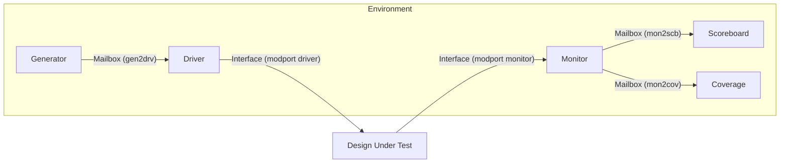

# SystemVerilog Verification: 16-bit Kogge-Stone Adder

This repository contains a complete **SystemVerilog verification environment** for a parameterizable Kogge-Stone Adder. The project demonstrates a layered testbench architecture with functional coverage to verify that the Design Under Test (DUT) correctly performs parallel prefix addition with optimal performance.

## 📌 Project Overview

* **Design Under Test (DUT):** 16-bit Kogge-Stone Adder (Parallel Prefix Adder)
* **Verification Methodology:** SystemVerilog OOP (Object Oriented Programming)
* **Architecture:** Layered Testbench (Generator, Driver, Monitor, Scoreboard, Coverage)
* **Communication:** Mailboxes for data transaction and Events for synchronization
* **Coverage:** Functional coverage with cross-coverage of input combinations

## 🔧 Design Under Test (DUT) - Kogge-Stone Adder

### Overview

The **Kogge-Stone Adder** is a parallel prefix adder that performs addition with logarithmic depth, making it one of the fastest adder architectures available. It achieves O(log₂n) delay by computing all intermediate carries in parallel using a tree structure.

### Key Features

* **Parameterizable Width:** Configurable WIDTH parameter (default: 16 bits)
* **Logarithmic Delay:** Number of stages = log₂(WIDTH) = 4 stages for 16-bit
* **Parallel Prefix Architecture:** Uses Generate (G) and Propagate (P) signals
* **Carry-in Support:** Incorporates carry-in at bit position 0
* **Optimal Performance:** Trades area for speed - more hardware but faster than ripple-carry adders

### Algorithm Stages

#### Stage 0: Initialization
Computes initial Propagate and Generate signals for each bit:
```
P[0][i] = A[i] XOR B[i]     // Propagate
G[0][i] = A[i] AND B[i]      // Generate
G[0][0] = A[0] AND B[0] OR (cin AND (A[0] XOR B[0]))  // Include carry-in
```

#### Stages 1 to log₂(WIDTH): Prefix Tree
Each stage combines signals at increasing distances (1, 2, 4, 8...):
```
Distance = 2^(stage-1)
For bit i >= distance:
    P[stage][i] = P[stage-1][i] AND P[stage-1][i-distance]
    G[stage][i] = G[stage-1][i] OR (P[stage-1][i] AND G[stage-1][i-distance])
```

#### Final Stage: Sum Computation
```
sum[0] = P[0][0] XOR cin
sum[i] = P[0][i] XOR G[final_stage][i-1]  // for i > 0
cout = G[final_stage][WIDTH-1]
```

### Module Interface

```systemverilog
module kogge_stone_adder #(
    parameter WIDTH = 16
) (
    input  logic [WIDTH-1:0] A,      // First operand
    input  logic [WIDTH-1:0] B,      // Second operand
    input  logic             cin,    // Carry input
    output logic [WIDTH-1:0] sum,    // Sum output
    output logic             cout    // Carry output
);
```

### Performance Characteristics

| Characteristic | Value (16-bit) |
|---------------|----------------|
| Number of Stages | 4 (log₂16) |
| Critical Path Delay | O(log n) |
| Area Complexity | O(n log n) |
| Advantage | Fastest parallel adder |
| Trade-off | Higher area vs ripple-carry |

### Example Operation

For a 16-bit addition: A=0x1234 + B=0x5678 + cin=1
1. **Stage 0:** Initialize 16 P and G signals
2. **Stage 1:** Combine at distance 1 (adjacent bits)
3. **Stage 2:** Combine at distance 2 (skip 1 bit)
4. **Stage 3:** Combine at distance 4 (skip 3 bits)
5. **Stage 4:** Combine at distance 8 (skip 7 bits)
6. **Output:** sum=0x68AD, cout=0

### Why Verify This Design?

The Kogge-Stone adder's complexity comes from:
- Multiple parallel computation stages
- Correct propagate/generate signal combinations
- Proper carry-in integration
- Edge cases at different bit positions
- Verification ensures all corner cases work correctly across the logarithmic tree structure

## 🏗️ Testbench Architecture

The testbench is organized into a modular environment where components communicate via **mailboxes** and **interfaces**.



### Key Features

* **Randomized Stimulus with Distribution:** Uses constrained randomization with `dist` constraints to ensure comprehensive coverage of input value ranges (min, low, mid, high, max bins)
* **Golden Reference Model:** The `scoreboard.sv` contains a reference model that independently calculates the expected sum and carry-out to verify the DUT's output
* **Functional Coverage:** Tracks coverage of input ranges, output ranges, carry-in, carry-out, and cross-coverage of input combinations
* **Event Synchronization:** The driver triggers a `sample_enable` event in the interface to notify the monitor exactly when to sample the stable output, preventing race conditions
* **Kogge-Stone Algorithm:** Implements the parallel prefix adder architecture for O(log n) delay with optimal performance

## 📂 File Structure

| File | Type | Description |
|------|------|-------------|
| `design.sv` | RTL | The 16-bit Kogge-Stone adder logic with configurable WIDTH parameter |
| `interface.sv` | Interface | Defines signals and modports (dut, driver, monitor) |
| `transaction.sv` | Class | Defines the packet with constrained random inputs (A, B, cin) and outputs (sum, cout) |
| `generator.sv` | Class | Generates transaction objects with distributed randomization |
| `driver.sv` | Class | Gets transactions from mailbox and drives signals to the interface |
| `monitor.sv` | Class | Waits for sample_enable, captures outputs, sends to both scoreboard and coverage |
| `scoreboard.sv` | Class | Compares DUT outputs against the expected addition logic and reports Pass/Fail |
| `coverage.sv` | Class | Collects functional coverage data on inputs, outputs, and their combinations |
| `environment.sv` | Class | Builds all components and connects mailboxes/interfaces |
| `top.sv` | Top Module | Connects the DUT and Environment; initiates the test |

## 🎯 Functional Coverage Strategy

The verification environment includes comprehensive functional coverage to ensure thorough testing of the adder:

### Coverage Groups

The `coverage.sv` file defines a covergroup `cg_kogge_stone_adder` with the following coverpoints:

#### Input Coverage
* **cp_A (Input A):** Divided into 5 bins
  - `min`: 16'h0000 (minimum value)
  - `low`: 16'h0001 to 16'h5555 (lower quartile)
  - `mid`: 16'h5556 to 16'hAAAA (middle range)
  - `high`: 16'hAAAB to 16'hFFFE (upper quartile)
  - `max`: 16'hFFFF (maximum value)

* **cp_B (Input B):** Same bin structure as Input A

* **cp_cin (Carry-in):** Tracks when carry-in is asserted (1'b1)

#### Output Coverage
* **cp_sum (Sum Output):** Same 5-bin structure to verify output distribution
* **cp_cout (Carry-out):** Tracks when carry-out is asserted (1'b1)

#### Cross Coverage
* **cross_A_B_cin:** Cross-coverage of Input A × Input B × Carry-in
  - This creates 5 × 5 × 1 = 25 coverage bins
  - Ensures all important input combinations are tested
  - Helps identify corner cases and boundary conditions

### Constrained Random Distribution

The `transaction.sv` file uses distribution constraints to align with coverage bins:

```systemverilog
A dist { 
    16'h0000                := 20,  // min bin
    [16'h0001 : 16'h5555]   :/ 20,  // low bin
    [16'h5556 : 16'hAAAA]   :/ 20,  // mid bin
    [16'hAAAB : 16'hFFFE]   :/ 20,  // high bin
    16'hFFFF                := 20   // max bin
};
```

This ensures even distribution across all coverage bins, leading to faster coverage closure.

### Coverage Reporting

During simulation, the coverage collector:
1. Receives transactions from the monitor via the `mon2cov` mailbox
2. Samples the covergroup for each transaction
3. Displays real-time coverage percentage: `[COVERAGE] Current Coverage: XX.XX%`
4. Allows post-simulation coverage analysis through standard coverage reporting tools

## ⚙️ How It Works

1. **Top Level:** The `tb_top` module instantiates the interface and the Kogge-Stone adder DUT. It creates the environment and passes the virtual interface handle

2. **Generation:** The generator creates randomized transaction packets with distribution constraints to hit all coverage bins efficiently

3. **Driving:** The driver applies inputs A, B, and cin to the interface, triggers the `sample_enable` event for proper synchronization

4. **Monitoring:** The monitor waits for the `sample_enable` event, samples the DUT's response, and sends transactions to both the scoreboard and coverage collector

5. **Checking:** The scoreboard calculates the expected sum and carry-out and compares with actual DUT results

6. **Coverage Collection:** The coverage module samples functional coverage and reports progress throughout the simulation

## 📊 Simulation Output

When you run the simulation, the console will display the transaction flow, coverage progress, and final results.

### Expected Log:

```
===========================================
Starting Kogge-Stone Adder Testbench
===========================================
[GENERATOR] Starting generation of 100 transactions
[DRIVER] Starting driver
[MONITOR] Starting monitor
[SCOREBOARD] Starting scoreboard
[COVERAGE] Starting coverage sampling

[GENERATOR] Generated Trans #1: A=0000, B=5555, Cin=1
-----------------------------------------------------------------------------------------------------------------------
[Monitor] Captured Trans: A=0000, B=5555, Cin=1, Sum=5556, Cout=0
[COVERAGE] Current Coverage: 4.00%
[SCOREBOARD] PASSED: A=0000, B=5555, Cin=1 => Sum=5556, Cout=0

[GENERATOR] Generated Trans #2: A=FFFF, B=FFFF, Cin=0
-----------------------------------------------------------------------------------------------------------------------
[Monitor] Captured Trans: A=FFFF, B=FFFF, Cin=0, Sum=FFFE, Cout=1
[COVERAGE] Current Coverage: 12.00%
[SCOREBOARD] PASSED: A=FFFF, B=FFFF, Cin=0 => Sum=FFFE, Cout=1

...

[GENERATOR] Generation complete
===========================================
[SCOREBOARD] Test Results:
PASSED: 100
FAILED: 0
TOTAL: 100
===========================================
[COVERAGE] Final Coverage: 100.00%
===========================================
Testbench Complete
===========================================
```

## 🛠️ How to Run

You can simulate this project using any standard SystemVerilog simulator (Vivado, QuestaSim, VCS, or EDA Playground).

### 🚀 Quick Start - EDA Playground

Try the live simulation on EDA Playground: **[Run on EDA Playground](https://www.edaplayground.com/x/bFBr)**

### Local Simulation

1. Compile all `.sv` files in order:
   - `transaction.sv`
   - `generator.sv`
   - `driver.sv`
   - `monitor.sv`
   - `scoreboard.sv`
   - `coverage.sv`
   - `environment.sv`
   - `design.sv`
   - `interface.sv`
   - `top.sv`

2. Set `tb_top` as the top-level simulation module

3. Run the simulation

4. (Optional) Generate coverage reports using your simulator's coverage tools

## 📝 Customization

### Change Data Width

Modify the `WIDTH` parameter in `design.sv`:

```systemverilog
module kogge_stone_adder #(
    parameter WIDTH = 32  // Change to desired width
)
```

Update `transaction.sv` accordingly.

### Change Test Length

Update the number of transactions in `environment.sv` or when instantiating:

```systemverilog
env = new(vif, 500); // Run 500 transactions
```

### Modify Coverage Bins

Edit the coverpoint definitions in `coverage.sv` to adjust bin ranges or add new coverpoints for specific corner cases.

### Adjust Random Distribution

Modify the `constraint c_coverage_dist` in `transaction.sv` to change the probability distribution of generated values.

## 🧪 Coverage Goals

For a complete verification:
- **Target:** 100% functional coverage
- **Cross-coverage:** All A × B × cin combinations should be hit
- **Corner cases:** Ensure min/max values for both inputs are tested
- **Carry propagation:** Verify carry-in and carry-out behavior across all ranges

## 📄 License

This project is open source and available under the MIT License.

## 🤝 Contributing

Contributions, issues, and feature requests are welcome! Feel free to check the issues page.

## 📧 Contact

For questions or feedback, please open an issue in this repository.

---

**Note:** This verification environment demonstrates industry-standard practices including layered testbench architecture, constrained random verification, functional coverage, and golden reference modeling.